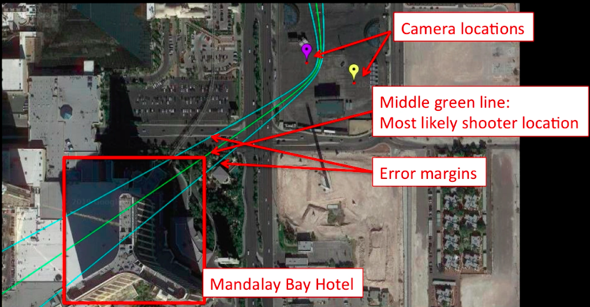

# VERA - The Shooter Localization System

This repository contains the code and models for the following paper:


**[Technical Report of the Video Event Reconstruction and Analysis (VERA) System - Shooter Localization, Models, Interface, and Beyond](https://arxiv.org/abs/1905.13313)** \
[Junwei Liang](https://www.cs.cmu.edu/~junweil/),
[Jay D. Aronson](https://www.cmu.edu/dietrich/history/people/faculty/aronson.html),
[Alexander Hauptmann](https://www.cs.cmu.edu/~alex/)

You can find more information/try out the shooter localization system at our [Project Page](https://vera.cs.cmu.edu/). Also, check out our 3D Reconstruction demo [here](https://vera.cs.cmu.edu/VERA_3D_Reconstruction).

## Introduction
We introduce the Video Event Reconstruction and Analysis (VERA) system, enabled by established machine learning techniques and physics models, that can localize the shooter location only based on a couple of user-generated videos that capture the gunshot sound. 


<div align="center">
  <div style="">
      
      
  </div>
  <p style="font-weight:bold;font-size:1.2em;">
  	<a href="http://www.youtube.com/watch?feature=player_embedded&v=z0KFTXg5sqI" target="_blank">Demo Video</a> &nbsp; &nbsp;
    <a href="http://www.youtube.com/watch?feature=player_embedded&v=6q7LqqzrY2I" target="_blank">Explanatory Video</a>
  </p>
</div>

If you find this system/code useful in your research/report then please cite

```
@article{liang2019vera,
    title={Technical Report of the Video Event Reconstruction and Analysis (VERA) System - Shooter Localization, Models, Interface, and Beyond},
    author={Liang, Junwei and Aronson, Jay D. and Hauptmann, Alexander},
    journal={arXiv preprint arXiv:1905.13313},
    year={2019}
}
@inproceedings{liang2017synchronization,
  title={Synchronization for multi-perspective videos in the wild},
  author={Liang, Junwei and Huang, Poyao and Chen, Jia and Hauptmann, Alexander},
  booktitle={2017 IEEE International Conference on Acoustics, Speech and Signal Processing (ICASSP)},
  pages={1592--1596},
  year={2017},
  organization={IEEE}
}
@inproceedings{liang2017temporal,
  title={Temporal localization of audio events for conflict monitoring in social media},
  author={Liang, Junwei and Jiang, Lu and Hauptmann, Alexander},
  booktitle={2017 IEEE International Conference on Acoustics, Speech and Signal Processing (ICASSP)},
  pages={1597--1601},
  year={2017},
  organization={IEEE}
}
```


## Purpose of This Repository
This repository includes all the necessary code and models to host our [VERA](https://vera.cs.cmu.edu/) system on your local machine.
Please report issues including:
- Bugs/security concerns
- Instsallation problems
- Explanation of the code
- Additional details needed to be explained in the technical report (or even typos)
- Feature requests


## Code Overview
- `web_interface` includes all the code needed for the web interface. It is written in PHP with Yii framework (v1.3). There are some Chinese comments in the code since the code is from my earlier days as a website designer in China. File an issue if you have a question. To find the code for a URL, for example, for "..index.php/application/cGunshot?videoname=firstshots_36_mXwckuEw.mp4", the code is in web_interface/protected/controllers/ApplicationController.php and in function "actionCGunshot". The view code is in web_interface/themes/basic/views/application/cGunshot.php
- `python_server` is the backend server we designed for PHP to communicate with machine learning code, which is usually written in PYTHON with Tensorflow. Currently we use shell calls within the python server so that we could change the machine learning code on the fly without restarting the backend server.
- `ml_code` includes the inferencing code for gunshot detection, gun type classification and audio synchronization.

To install the system on your machine you need to know about basic Linux Shell command, Apache server and MySQL database. To modify the web interface code, you will need to know PHP, Javascript with JQuery, html/css, and some knowledge of the Model/View/Controller (MVC) framework (Yii v1). To modify the machine learning code, you will need to know PYTHON and read our paper on [Video Synchronization](https://ieeexplore.ieee.org/abstract/document/7952425) and [Audio Event Temporal Localization](https://ieeexplore.ieee.org/abstract/document/7952426). I have tested the code on a CPU machine with Ubuntu 16.04.

## Installation
Instructions for installing the system on your local machine can be [found here](INSTALL.md).

## Future Directions
1. Automatic visual synchronization of videos;
2. Automatic detection of muzzle blast sound and shockwave sound in videos;
3. Better gun type/bullet type classification to get estimation of the bullet speed range;
4. Automatic video localization - putting camera on the map.

## Other Notes
1. Method 1 code is in python_server/run.py "gunshotLocalizationMethod1".
2. Method 2 code is in web_interface/themes/basic/views/application/cMainPage.php javascript function "declare_canvas_class_method2"

